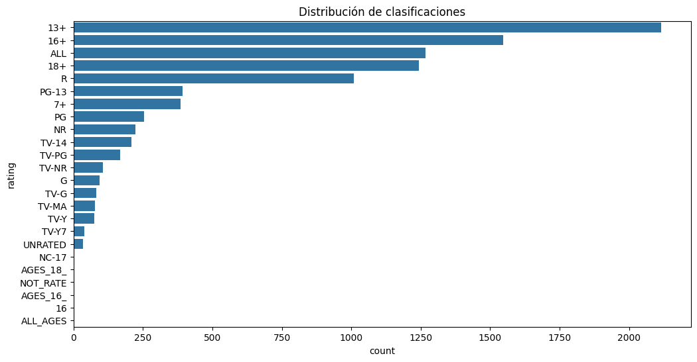

# TAREA 3 - GRUPO 01 

##  Descripción del propósito del dataset: Amazon Prime Videos Titles

El propósito principal del dataset **"Amazon Prime Video Titles"** es proporcionar una visión estructurada y detallada del catálogo de contenido disponible en la plataforma de streaming Amazon Prime Video. Este conjunto de datos recopila información clave sobre miles de títulos, tanto películas como series, y sirve como base para realizar análisis exploratorios de datos (EDA), estudios de tendencias en la industria del entretenimiento, segmentación de audiencias, y evaluaciones de la diversidad y evolución del contenido a lo largo del tiempo.

El dataset permite a investigadores, analistas de datos y estudiantes:

- **Analizar la composición del catálogo** en términos de tipo de contenido (películas vs series), géneros, duración, año de lanzamiento y clasificación por edades.
- **Estudiar tendencias temporales**, como la cantidad de contenido agregado por año o el crecimiento del catálogo desde su inicio.
- **Identificar patrones geográficos**, evaluando la distribución de contenido por país de producción y detectando los mercados más representados.
- **Examinar el impacto de directores y actores** recurrentes en la plataforma.
- **Evaluar la diversidad del contenido**, tanto en términos de origen geográfico como de variedad temática.
- **Apoyar el desarrollo de modelos de recomendación**, clasificación o predicción, gracias a sus atributos estructurados.

El dataset fue seleccionado debido al gran valor educativo y analítico, ya que permite aplicar técnicas de limpieza, visualización, análisis estadístico y aprendizaje automático, en un contexto real y actual como lo es el contenido digital bajo demanda.

## Pasos de limpieza y transformación 

* Revisión inicial de los datos
Se cargó el dataset amazon_prime_titles.csv.

Se verificaron las columnas, tipos de datos y valores nulos.

* Eliminación de duplicados

Algunos títulos aparecían repetidos en el dataset.

Se eliminaron con drop_duplicates() para evitar que influyeran en el análisis.

* Manejo de valores nulos

Columnas como director, cast y country tenían valores faltantes.

Se completaron con "Desconocido" en caso de países o se dejaron vacíos para no perder registros importantes.

* Normalización de texto

Se aplicó str.strip() y str.title() a columnas como title, director y country para mantener un formato uniforme.

Ejemplo: "united states" → "United States".

* Conversión de fechas

La columna date_added fue convertida a formato de fecha (datetime) para poder agrupar y filtrar por año de incorporación.

* Transformación de la duración

La columna duration contenía tanto minutos (para películas) como temporadas (para series).

Se dividió en dos campos nuevos:

duration_minutes → para películas.

duration_seasons → para series.

* División de géneros

La columna listed_in contenía varios géneros separados por comas.

Se separaron en una lista con str.split(",") para identificar los géneros más frecuentes.

* Filtro por años de lanzamiento

Se validó que release_year sea un número entero.

Se restringió el rango de años para análisis entre el mínimo y máximo detectado.

## Principales Hallazgos del Análisis

* Distribución de contenido: El dataset contiene 9,668 títulos iniciales, con una distribución equilibrada mayor de películas al contrario de series series.

* Procedencia geográfica: Estados Unidos e India son los principales productores de contenido, representando la mayoría del catálogo.

* Tendencia temporal: Se observa un crecimiento significativo en la producción de contenido a partir de 2015, con un pico notable en años recientes.

* Clasificaciones por edad: La clasificación TV-MA (contenido para audiencias maduras) es la más común en la plataforma.

* Datos faltantes: Se identificaron valores nulos significativos en columnas como director (2,083), cast (1,233), país (8,996) y fecha de adición (9,513), lo que sugiere limitaciones en la completitud del dataset.

* La distribución de clasificaciones revela que TV-MA (contenido para audiencias maduras) es, con gran diferencia, la categoría predominante en Amazon Prime Video, seguida de TV-14 y TV-PG. Esta clara concentración indica que la plataforma tiene una estrategia de contenido dirigida principalmente a un público adulto y adolescente, posicionándose como un servicio de entretenimiento para mayores de 14 años. La casi inexistencia de contenido categorizado como infantil o familiar (como TV-Y o TV-G) sugiere una oportunidad de crecimiento en ese segmento de mercado, que actualmente parece estar desatendido en su catálogo. Esta estrategia podría estar alineada con la intención de diferenciarse de otros servicios de streaming que tienen una oferta más familiar, aunque también limita su base potencial de suscriptores.

## Insights y Conclusiones Relevantes
* Estrategia de contenido global: Amazon Prime Video muestra una clara estrategia de localización, con fuerte inversión en contenido estadounidense e indio, reflejando sus mercados principales.

* Enfoque en contenido adulto: La predominancia de clasificaciones TV-MA sugiere que la plataforma se orienta principalmente a audiencias adultas.

* Crecimiento acelerado: El aumento significativo de contenido a partir de 2015 coincide con la intensificación de la competencia en streaming, indicando una respuesta competitiva al mercado.

* Limitaciones de datos: La significante cantidad de datos faltantes en columnas clave como país y director limita el análisis geográfico y de autoría, sugiriendo la necesidad de mejorar los procesos de recolección de datos.

* Oportunidad de expansión: La fuerte concentración en pocos países sugiere oportunidades de crecimiento mediante la inversión en contenido de regiones menos representadas.

* Este análisis proporciona insights valiosos para la toma de decisiones estratégicas sobre adquisición y producción de contenido, así como para el desarrollo de campañas de marketing dirigidas a segmentos específicos de audiencia.

